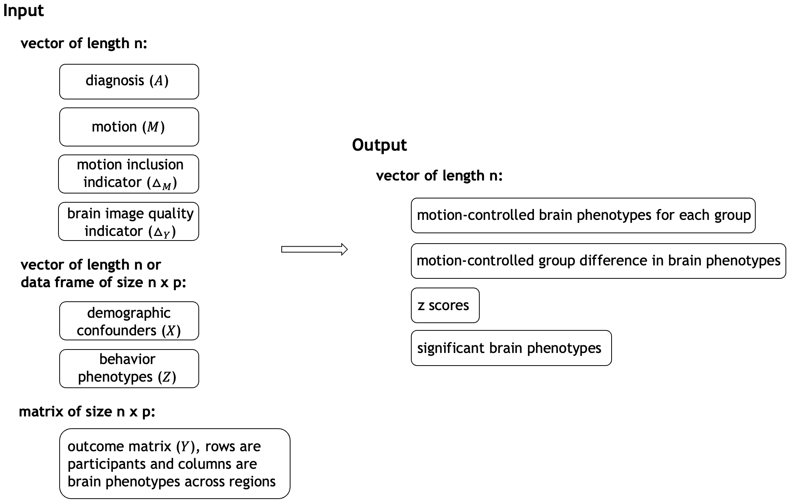

MoCo: **Mo**tion-**Co**ntrolled Brain Phenotype Differences Between Groups 
===================================================

MoCo is an R package designed to remove motion artifacts in brain phenotype analysis. Please note that MoCo is still under development.

## Installation

Ensure you have the following R packages installed:

-   SuperLearner
-   haldensify
-   devtools

You can install them by running the following code:

``` r
if(!require(c("SuperLearner","haldensify", "devtools"))){
    install.packages(c("SuperLearner","haldensify", "devtools"))
}
```

Then, you can install MoCo from GitHub using the following code:

```{r}
library(devtools)
install_github("thebrisklab/MoCo")

library(MoCo)
```

## Description of the main function

The `moco()` function serves as the main function of MoCo. The input and output of the function are illustrated in the figure below.



```
moco(
  X, Z, A, M, Y, 
  Delta_M, 
  thresh = NULL,
  Delta_Y,
  SL_library = c("SL.earth","SL.glmnet","SL.gam","SL.glm", "SL.glm.interaction", "SL.step","SL.step.interaction","SL.xgboost","SL.ranger","SL.mean"),
  SL_library_customize = list(
    gA = NULL, 
    gDM = NULL,
    gDY_AX = NULL,
    gDY_AXZ = NULL,
    mu_AMXZ = NULL,
    eta_AXZ = NULL,
    eta_AXM = NULL,
    xi_AX = NULL
  ), 
  glm_formula = list(gA = NULL, 
                     gDM = NULL,
                     gDY_AX = NULL,
                     gDY_AXZ = NULL,
                     mu_AMXZ = NULL,
                     eta_AXZ = NULL,
                     eta_AXM = NULL,
                     xi_AX = NULL,
                     pMX = NULL,
                     pMXZ = NULL),
  HAL_pMX = TRUE,
  HAL_pMXZ = TRUE,
  HAL_options = list(max_degree = 3, lambda_seq = exp(seq(-1, -10, length = 100)), num_knots = c(1000, 500, 250)),
  cross_fit = TRUE,
  cv_folds = 5,
  test = TRUE,
  fwer = 0.05, 
  seed_rgn = 1, 
  ...
)
```

- `X`: A dataframe or matrix containing demographic confounders that would ideally be balanced in a randomized controlled trial.
- `Z`: A dataframe or matrix of covariates representing brain phenotypes.
- `A`: A binary vector of length n (number of participants), serving as a group indicator, such as diagnosis group or control group.
- `M`: A numeric vector of length n representing continuous motion values for each participant.
- `Y`: A matrix of dimension n $\times$ p, where n is the number of participants, and p is the number of regions of interest.
    - If it represents seed-based association measures: Each (i, j) element denotes participant i's association measure between the seed region and region j. The column representing the association measure of the seed region with itself should be filled with NA values to indicate its position.
    - If it represents other types of association measures: Each (i, j) element denotes participant i's association measure between two brain regions of interest, such as the upper diagonal part of the functional connectivity matrix. No NA values are allowed in Y in this case.
- `Delta_M`: A binary vector of length n indicating whether motion is available and meets inclusion criteria. If motion meets inclusion criteria for analysis, set Delta\_M = 1; otherwise, set Delta\_M = 0.                
- `thresh`: A numeric value used to threshold M to produce Delta_M. One can specify either Delta\_M or thresh.
- `Delta_Y`: A binary vector indicating the non-missingness and whether the brain image data `Y` passes quality control after preprocessing. Set `Delta_Y = 1` if `Y` is usable; otherwise, set `Delta_Y = 0`.
- `SL_library`: SuperLearner library for estimating nuisance regressions. Defaults to c("SL.earth","SL.glmnet","SL.gam","SL.glm", "SL.glm.interaction", "SL.step","SL.step.interaction","SL.xgboost","SL.ranger","SL.mean") if not specified.
- `SL_library_customize`: Customize SuperLearner library for estimating each nuisance regression.
  - `gA`: SuperLearner library for estimating the propensity score.
  - `gDM`: SuperLearner library for estimating the probability P(Delta_M = 1 | A, X).
  - `gDY_AX`: SuperLearner library for estimating the probability P(Delta_Y = 1 | A, X).
  - `gDY_AXZ`: SuperLearner library for estimating the probability P(Delta_Y = 1 | A, X, Z).
  - `mu_AMXZ`: SuperLearner library for estimating the outcome regression E(Y | Delta_Y = 1, A, M, X, Z).
  - `eta_AXZ`: SuperLearner library for estimating E(mu_AMXZ pMXD / pMXZD | A, X, Z, Delta_M = 1).
  - `eta_AXM`: SuperLearner library for estimating E(mu_AMXZ pMX/pMXZ gDY_AX/gDY_AXZ | A, M, X, Delta_Y = 1).
  - `xi_AX`: SuperLearner library for estimating E(eta_AXZ | A, X).
- `glm_formula`: All glm formulas default to NULL, indicating SuperLearner will be used for nuisance regressions.
  - `gA`: GLM formula for estimating the propensity score.
  - `gDM`: GLM formula for estimating the probability P(Delta_M = 1 | A, X).
  - `gDY_AX`: GLM formula for estimating the probability P(Delta_Y = 1 | A, X).
  - `gDY_AXZ`: GLM formula for estimating the probability P(Delta_Y = 1 | A, X, Z).
  - `mu_AMXZ`: GLM formula for estimating the outcome regression E(Y | Delta_Y = 1, A, M, X, Z).
  - `eta_AXZ`: GLM formula for estimating E(mu_AMXZ pMXD / pMXZD | A, X, Z, Delta_M = 1).
  - `eta_AXM`: GLM formula for estimating E(mu_AMXZ pMX/pMXZ gDY_AX/gDY_AXZ | A, M, X, Delta_Y = 1).
  - `xi_AX`: GLM formula for estimating E(eta_AXZ | A, X).
  - `pMX`: GLM formula for estimating p(m | a, x, Delta_Y = 1) and p(m | a, x, Delta_M = 1), assuming M follows a log normal distribution.
  - `pMXZ`: GLM formula for estimating p(m | a, x, z, Delta_Y = 1) and p(m | a, x, z, Delta_M = 1), assuming M follows a log normal distribution.
- `HAL_pMX`: Specifies whether to estimate p(m | a, x, Delta_Y = 1) and p(m | a, x, Delta_M=1) using the highly adaptive lasso conditional density estimation method. Defaults to TRUE. If set to FALSE, please specify the pMX option in glm_formula, such as pMX = ".".
- `HAL_pMXZ`: Specifies whether to estimate p(m | a, x, z, Delta_Y = 1) and p(m | a, x, z, Delta_M=1) using the highly adaptive lasso conditional density estimation method. Defaults to TRUE. If set to FALSE, please specify the pMXZ option in glm_formula, such as pMXZ = ".".
- `HAL_options`: Additional options for the highly adaptive lasso (HAL) method. These will be passed to the haldensify function in the haldensify package.
  - `max_degree`: The highest order of interaction terms for generating basis functions.
  - `lambda_seq`: A numeric sequence of values for the regularization parameter of Lasso regression.
  - `num_knots`: The maximum number of knot points (i.e., bins) for any covariate for generating basis functions.
- `cross_fit`: Logical indicating whether to develop the estimator based on cross-fitting. Defaults to TRUE.
- `test`: Logical indicating whether to conduct hypothesis testing based on simultaneous confidence band. Defaults to TRUE.
- `fwer`: A vector of family-wise error rates (FWER) to control for multiple hypothesis testing. Defaults to c(0.05). Set to NULL if `test` is FALSE.
- `seed_rgn`: Specifies the value of seed(s) for nuisance regression calculation using super learner. Can be a vector. Defaults to value 1. 

## Tutorial

In this tutorial, we demonstrate the application of the MoCo package with a straightforward example analysis. We generate a simulated dataset based on the Autism Brain Imaging Data Exchange [(ABIDE)](https://www.nature.com/articles/mp201378). Our seed region of interest is the default mode network (DMN). We are interested in studying the functional connectivity between DMN and the other six regions defined using the [Yeo 7 parcellation](https://www.ncbi.nlm.nih.gov/pmc/articles/PMC3174820/). We use MoCo to compute the motion-controlled mean functional connectivity and associations. 

```
# library
library(MoCo)

# load data
data(data)

# inspect the data
str(data)
```

The dataset includes a total of $n = 400$ participants. A, M, Delta\_M, Delta\_Y are vectors of length $n$: Each element of A denotes a participant's diagnostic status, with 1 representing ASD and 0 representing non-ASD. M represents continuous motion values corresponding to mean FD. Participants are classified as having high motion if M exceeds 0.2 (Delta\_M = 0), consistent with the threshold used in the analysis of real data. The binary indicator Delta\_Y is a binary indicator equal to 0 for participants with poor-quality preprocessed images and 1 otherwise. The proportion of participants with Delta\_Y=0 is 7\%. 

Demographic confounders X and behavioral phenotypes Z are represented as data frames, each containing multiple variables. Data frame X is of size $n \times 3$, containing three demographic dimensions: sex (X1), age (X2), and handedness (X3). In X1, females are coded as 0 and males as 1. X2 represents age as a continuous numeric value. X3 indicates handedness, with left-handed individuals coded as 0 and right-handed individuals as 1. Data frame Z is of size $n \times 4$, containing four behavior phenotypes. Z1 represents scores from the Autism Diagnostic Observation Schedule (ADOS), which measures social disability. Z2 contains the FIQ scores. Medication status is captured in two dimensions: Z3 indicates stimulant medication use, and Z4 indicates non-stimulant medication use. For both Z3 and Z4, a value of 0 denotes that the individual is not currently taking the respective medication.

The functional connectivity matrix Y has dimensions $n \times 7$. Each row represents the z-transformed functional connectivity derived from rs-fMRI between the seed region and the other regions for a given participant. The 7th column, representing the functional connectivity of the seed region with itself, is filled with NA values to indicate its position. For participants with Delta\_Y = 0, the corresponding rows in Y contain all NAs, as their functional connectivity data is not available. The true differences in functional connectivity between each region and region 7 are as follows: for regions 1-4, the association is 0; for region 5, it is -0.0485; and for region 6, it is -0.0682. Region 5 and 6 are set to have significant associations.
