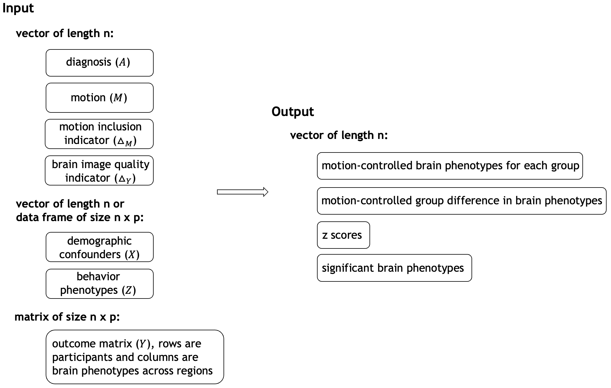

# MoCo: **Mo**tion-**Co**ntrolled Brain-Phenotype Differences Between Groups


> Nonparametric estimation of group-specific brain-phenotype means and group
> differences while accounting for motion-related selection.

MoCo is an R package for brain-imaging analyses in which motion affects both
data quality and inclusion in the analyzed sample. The package combines
one-step estimation, flexible nuisance-function learning, optional
cross-fitting, and efficient-influence-function (EIF) inference. Outcomes may
be functional-connectivity edges, regional imaging measures, or other
continuous brain phenotypes.

MoCo is under active development.

## Highlights

- A single high-level function, `moco()`, supports HAL, log-normal GLM, and
  generalized-gamma GAMLSS models for conditional motion densities.
- Nuisance regressions can be estimated with Super Learner or user-specified
  GLMs.
- Cross-fitting and repeated cross-fitting are supported.
- A vector, one-column matrix, or multi-column outcome matrix can be analyzed.
- EIF-based simultaneous confidence bands control the family-wise error rate
  (FWER) across multiple outcomes.
- Structurally missing outcome columns, such as seed-to-self correlations, are
  removed during estimation and restored as `NA` in the output.

## Installation

Install the development version from GitHub:

```r
# install.packages("remotes")
remotes::install_github("thebrisklab/MoCo")
```

Then load the package:

```r
library(MoCo)
```

Core dependencies are installed with MoCo. Packages corresponding to optional
Super Learner wrappers—such as `glmnet`, `ranger`, and `xgboost`—are needed
only when those learners are requested. Surface plotting additionally requires
`ciftiTools` and Connectome Workbench.

## Quick start

The bundled example data can be used for a lightweight GLM-based analysis:

```r
library(MoCo)
data(data)

fit_glm <- moco(
  X = data$X,
  Z = data$Z,
  A = data$A,
  M = data$M,
  Y = data$Y,
  Delta_M = data$Delta_M,
  Delta_Y = data$Delta_Y,
  pMX_method = "GLM",
  pMXZ_method = "GLM",
  glm_formula = list(pMX = ".", pMXZ = "."),
  SL_library = c("SL.mean", "SL.glm", "SL.glm.interaction"),
  cross_fit = TRUE,
  cv_folds = 5,
  seed_rgn = 1,
  test = TRUE,
  fwer = 0.05
)

fit_glm$est
fit_glm$adj_association
fit_glm$z_score
fit_glm$significant_regions
```

The main outputs are:

| Output | Description |
|---|---|
| `est` | Adjusted outcome means for `A = 0` and `A = 1` |
| `adj_association` | Adjusted difference, `A = 1` minus `A = 0` |
| `density_method` | Motion-density methods used for `pMX` and `pMXZ` |
| `z_score` | EIF-based standardized statistic for each outcome |
| `conf_band` | Simultaneous critical value for each requested FWER |
| `significant_regions` | Simultaneous-test decisions |
| `gamlss_selection_runs` | GAMLSS fitting information, when applicable |

## Data interface



`moco()` uses the following data objects:

| Object | Role |
|---|---|
| `A` | Binary exposure or group indicator |
| `X` | Baseline covariates |
| `Z` | Post-exposure covariates used in the selection-bias adjustment |
| `M` | Continuous motion measure |
| `Y` | Continuous outcome vector or an `n` by `p` outcome matrix |
| `Delta_M` | Indicator that motion satisfies the analysis inclusion rule |
| `Delta_Y` | Indicator that the imaging outcome is observed and usable |

`A`, `X`, and `Z` must be complete. `Y` may contain missing values in rows for
which `Delta_Y = 0`. For a seed-based analysis, a seed-to-self outcome column
may be entirely missing; MoCo restores that position as `NA` in its outputs.

`Delta_M` can be supplied directly or constructed inside `moco()` by supplying
`thresh`. The definitions of `Delta_M` and `Delta_Y` should be prespecified and
reported with the analysis.

## Choosing a motion-density model

MoCo estimates two conditional motion densities:

- `pMX`: a density conditional on `A` and `X`;
- `pMXZ`: a density conditional on `A`, `X`, and `Z`.

Choose their estimators with `pMX_method` and `pMXZ_method`. If
`pMXZ_method = NULL`, it uses the method selected by `pMX_method`.

| Method | Configuration | Use case |
|---|---|---|
| HAL | `pMX_method = "HAL"` | Flexible conditional-density estimation with minimal distributional structure |
| GLM | `pMX_method = "GLM"` and `glm_formula$pMX`/`pMXZ` | Parsimonious log-normal motion-density model |
| GAMLSS | `pMX_method = "GAMLSS"` | Flexible distributional regression for positive motion values |

The methods for `pMX` and `pMXZ` may differ, although using the same method for
both is generally easier to interpret and diagnose.

### Highly adaptive lasso

HAL is the default motion-density method. Its basis-function construction and
regularization path can be controlled with `HAL_options`:

```r
fit_hal <- moco(
  X = data$X,
  Z = data$Z,
  A = data$A,
  M = data$M,
  Y = data$Y,
  Delta_M = data$Delta_M,
  Delta_Y = data$Delta_Y,
  pMX_method = "HAL",
  pMXZ_method = "HAL"
)
```

### Log-normal GLM

For GLM motion densities, specify the right-hand side of the `pMX` and `pMXZ`
models. A value of `"."` uses all available predictors for the corresponding
density:

```r
fit_glm <- moco(
  X = data$X,
  Z = data$Z,
  A = data$A,
  M = data$M,
  Y = data$Y,
  Delta_M = data$Delta_M,
  Delta_Y = data$Delta_Y,
  pMX_method = "GLM",
  pMXZ_method = "GLM",
  glm_formula = list(pMX = ".", pMXZ = ".")
)
```

### Generalized-gamma GAMLSS

GAMLSS is useful when a log-normal motion model is too restrictive. The
current implementation uses the generalized gamma (`GG`) family. Continuous
covariates named in `gamlss_continuous_X` and `gamlss_continuous_Z` enter the
location and scale models through `gamlss::pb()`; other covariates enter
linearly, `A` enters the location model, and the shape parameter is constant.

Motion observations used in GAMLSS density fitting must be finite and strictly
positive. Convergence depends on the empirical motion distribution, sample
size, covariate design, and optimizer. The optimizer changes the numerical
fitting algorithm, not the statistical model.

```r
fit_gamlss <- moco(
  X = data$X,
  Z = data$Z,
  A = data$A,
  M = data$M,
  Y = data$Y,
  Delta_M = data$Delta_M,
  Delta_Y = data$Delta_Y,
  pMX_method = "GAMLSS",
  pMXZ_method = "GAMLSS",
  gamlss_continuous_X = names(data$X)[
    vapply(data$X, is.numeric, logical(1))
  ],
  gamlss_continuous_Z = names(data$Z)[
    vapply(data$Z, is.numeric, logical(1))
  ],
  gamlss_optimizer = "RS",
  n.cyc = 300,
  cross_fit = TRUE,
  cv_folds = 5,
  test = TRUE,
  fwer = c(0.05, 0.20)
)
```

The bundled simulated data demonstrate the API but are not intended as a
GAMLSS convergence benchmark.

#### GAMLSS arguments

| Argument | Description |
|---|---|
| `gamlss_family` | Density family; currently restricted to `"GG"` |
| `gamlss_optimizer` | `"RS"`, `"CG"`, or `"mixed"`; `"mixed"` uses `gamlss::mixed(1, 50)` |
| `gamlss_continuous_X` | Continuous columns of `X` modeled with penalized splines |
| `gamlss_continuous_Z` | Continuous columns of `Z` modeled with penalized splines |
| `n.cyc` | Maximum number of GAMLSS fitting cycles |
| `gamlss_bic_trace` | Whether to display GAMLSS fitting progress |
| `gamlss_formula` | Reserved for interface compatibility |
| `GAMLSS_BIC_select` | Reserved; model-structure selection is not currently performed |
| `gamlss_bic_candidates` | Reserved for interface compatibility |

## Tutorial: an ABIDE-like seed-based analysis

The bundled data contain 400 simulated participants and reproduce the layout
of a seed-based analysis motivated by the Autism Brain Imaging Data Exchange
(ABIDE). The seed is the default mode network (DMN), and the outcomes represent
its Fisher-z-transformed functional connectivity with networks from the Yeo
seven-network parcellation.

```r
library(MoCo)
data(data)
str(data)
```

The simulated objects are:

- `A`: diagnostic group, coded 1 for ASD and 0 for non-ASD;
- `M`: mean framewise displacement;
- `Delta_M`: motion inclusion, with high motion defined in the simulation as
  mean FD greater than 0.2;
- `Delta_Y`: imaging-data availability and quality;
- `X`: sex, age, and handedness;
- `Z`: ADOS, full-scale IQ, stimulant medication, and nonstimulant medication;
- `Y`: an `n` by 7 functional-connectivity matrix.

The seventh column of `Y` is the seed-to-self position and is therefore
entirely `NA`. Rows with `Delta_Y = 0` are also missing because their imaging
outcomes are unavailable. The simulated group differences are zero for the
first four outcomes, -0.0485 for the fifth, and -0.0682 for the sixth.

For a fast illustration, fit log-normal GLM motion densities and a compact
Super Learner library:

```r
fit_abide <- moco(
  X = data$X,
  Z = data$Z,
  A = data$A,
  M = data$M,
  Y = data$Y,
  Delta_M = data$Delta_M,
  Delta_Y = data$Delta_Y,
  SL_library = c("SL.mean", "SL.glm", "SL.glm.interaction"),
  glm_formula = list(pMX = ".", pMXZ = "."),
  pMX_method = "GLM",
  pMXZ_method = "GLM",
  cross_fit = TRUE,
  cv_folds = 5,
  seed_rgn = 1,
  test = TRUE,
  fwer = 0.05
)
```

The adjusted means are stored in `est`. The first row represents `A = 0`, the
second represents `A = 1`, and the structural seventh column is restored as
`NA`:

```r
round(fit_abide$est, 4)
# est_A0 -0.2180 -0.1632 -0.1823  0.0535  0.0388  0.0828 NA
# est_A1 -0.2194 -0.1654 -0.1813  0.0513 -0.0084  0.0141 NA
```

The adjusted group differences are:

```r
round(fit_abide$adj_association, 4)
# -0.0014 -0.0023  0.0010 -0.0022 -0.0472 -0.0687 NA
```

The EIF-based test results are:

```r
round(fit_abide$z_score, 4)
# -0.0586 -0.0853  0.0413 -0.0933 -1.9196 -3.3033 NA

fit_abide$significant_regions
# FALSE FALSE FALSE FALSE FALSE TRUE NA
```

The numerical output above is illustrative; results may vary slightly with R,
dependency, and numerical-optimization versions.

For a flexible HAL analysis, the same example can be fitted using the default
motion-density method:

```r
fit_abide_hal <- moco(
  X = data$X,
  Z = data$Z,
  A = data$A,
  M = data$M,
  Y = data$Y,
  Delta_M = data$Delta_M,
  Delta_Y = data$Delta_Y
)
```

## Multiple outcomes and repeated cross-fitting

For simultaneous inference, pass all outcomes in the same `Y` matrix. MoCo
uses their joint participant-level EIF correlation structure to obtain one
simultaneous critical value at each requested FWER.

Multiple values in `seed_rgn` request repeated cross-fitting partitions; they
are not multiple GAMLSS optimizer initializations. MoCo performs repeated-seed
aggregation in the following order:

1. Average group-specific estimates across seeds.
2. Average participant-level EIFs across seeds.
3. Recompute covariance from the averaged EIFs.
4. Calculate z-statistics and simultaneous critical values.

Seed-specific z-statistics, p-values, covariance matrices, or critical values
should not be averaged directly.

```r
fit_repeated <- moco(
  X = data$X,
  Z = data$Z,
  A = data$A,
  M = data$M,
  Y = data$Y,
  Delta_M = data$Delta_M,
  Delta_Y = data$Delta_Y,
  pMX_method = "GLM",
  pMXZ_method = "GLM",
  glm_formula = list(pMX = ".", pMXZ = "."),
  seed_rgn = 1:10,
  test_seed = 123,
  test_n_sim = 500000,
  test_chunk_size = 25000,
  fwer = c(0.05, 0.10, 0.20)
)
```

For one outcome, the procedure reduces to a one-dimensional EIF test. For
multiple outcomes, `hypo_test()` simulates the maximum absolute statistic from
their joint EIF correlation matrix. Use `hypo_test()` directly only when the
estimates and participant-level EIFs have already been aggregated across
repeated seeds and covariance has been recomputed.

## Function reference

The complete function documentation is available from R:

```r
?moco
?hypo_test
?plot_moco
```

<details>
<summary><strong>Complete <code>moco()</code> interface</strong></summary>

```r
moco(
  X, Z, A, M, Y,
  Delta_M = NULL,
  thresh = NULL,
  Delta_Y,
  SL_library = c(
    "SL.earth", "SL.glmnet", "SL.gam", "SL.glm",
    "SL.glm.interaction", "SL.step", "SL.step.interaction",
    "SL.xgboost", "SL.ranger", "SL.mean"
  ),
  SL_library_customize = list(
    gA = NULL, gDM = NULL, gDY_AX = NULL, gDY_AXZ = NULL,
    mu_AMXZ = NULL, eta_AXZ = NULL, eta_AXM = NULL, xi_AX = NULL
  ),
  glm_formula = list(
    gA = NULL, gDM = NULL, gDY_AX = NULL, gDY_AXZ = NULL,
    mu_AMXZ = NULL, eta_AXZ = NULL, eta_AXM = NULL, xi_AX = NULL,
    pMX = NULL, pMXZ = NULL
  ),
  pMX_method = c("HAL", "GLM", "GAMLSS"),
  pMXZ_method = NULL,
  gamlss_formula = list(
    pMX_mu = NULL, pMX_sigma = ~ 1, pMX_nu = ~ 1,
    pMXZ_mu = NULL, pMXZ_sigma = ~ 1, pMXZ_nu = ~ 1
  ),
  gamlss_family = "GG",
  gamlss_optimizer = "RS",
  GAMLSS_BIC_select = FALSE,
  gamlss_continuous_X = character(0),
  gamlss_continuous_Z = character(0),
  gamlss_bic_candidates = c("linear", "pb_mu", "pb_mu_sigma"),
  gamlss_bic_trace = FALSE,
  n.cyc = 300,
  HAL_options = list(
    max_degree = 3,
    lambda_seq = exp(seq(-1, -10, length = 100)),
    num_knots = c(1000, 500, 250)
  ),
  cross_fit = TRUE,
  cv_folds = 5,
  test = TRUE,
  fwer = 0.05,
  seed_rgn = 1,
  test_seed = 1,
  test_n_sim = 100000L,
  test_chunk_size = 25000L,
  ...
)
```

### Nuisance-model components

`SL_library_customize` and `glm_formula` may configure the following nuisance
functions separately:

| Component | Target |
|---|---|
| `gA` | Propensity score, `P(A = 1 | X)` |
| `gDM` | Motion inclusion, `P(Delta_M = 1 | A, X)` |
| `gDY_AX` | Outcome observation, `P(Delta_Y = 1 | A, X)` |
| `gDY_AXZ` | Outcome observation, `P(Delta_Y = 1 | A, X, Z)` |
| `mu_AMXZ` | Outcome regression, `E(Y | Delta_Y = 1, A, M, X, Z)` |
| `eta_AXZ` | Pseudo-outcome regression conditional on `A`, `X`, and `Z` |
| `eta_AXM` | Pseudo-outcome regression conditional on `A`, `M`, and `X` |
| `xi_AX` | Regression of `eta_AXZ` conditional on `A` and `X` |
| `pMX` | Motion density conditional on `A` and `X` |
| `pMXZ` | Motion density conditional on `A`, `X`, and `Z` |

### Other controls

| Argument | Description |
|---|---|
| `SL_library` | Common Super Learner library for nuisance regressions |
| `SL_library_customize` | Separate libraries for `gA`, `gDM`, `gDY_AX`, `gDY_AXZ`, `mu_AMXZ`, `eta_AXZ`, `eta_AXM`, and `xi_AX` |
| `glm_formula` | Right-hand-side formulas for nuisance GLMs and GLM motion densities |
| `HAL_options` | HAL basis and regularization controls |
| `cross_fit` | Whether to use cross-fitting |
| `cv_folds` | Number of cross-fitting folds |
| `seed_rgn` | Nuisance-fitting and cross-fitting seed or seeds |
| `test` | Whether to run simultaneous EIF inference |
| `fwer` | Requested family-wise error rates |
| `test_seed` | Monte Carlo seed for simultaneous testing |
| `test_n_sim` | Number of multivariate-normal simulation draws |
| `test_chunk_size` | Maximum draws generated at once to limit memory use |

</details>

## Reproducibility and diagnostics

- Use named columns in `X` and `Z`, especially for GAMLSS.
- Save analysis-cohort IDs and preserve their order across outcomes and seeds.
- Define `Delta_M` and `Delta_Y` explicitly in the analysis script.
- Use the same outcome family when comparing simultaneous tests across methods.
- Save the R version, package versions, learner library, fold count, and seeds.
- Examine GAMLSS convergence and distributional diagnostics before interpreting
  GAMLSS-based results.
- In distributed analyses, save estimates and participant-level EIFs for every
  outcome and seed, then aggregate them before calculating covariance and test
  statistics.

## Related software and resources

- [SuperLearner](https://github.com/ecpolley/SuperLearner): ensemble learning
  for nuisance-function estimation.
- [haldensify](https://github.com/nhejazi/haldensify): highly adaptive lasso
  conditional-density estimation.
- [gamlss](https://github.com/gamlss-dev/gamlss): generalized additive models
  for location, scale, and shape.
- [ABIDE](https://www.nature.com/articles/mp201378): motivating neuroimaging
  data resource for the bundled simulation.
- [Yeo seven-network parcellation](https://www.ncbi.nlm.nih.gov/pmc/articles/PMC3174820/):
  network definition used in the tutorial.
